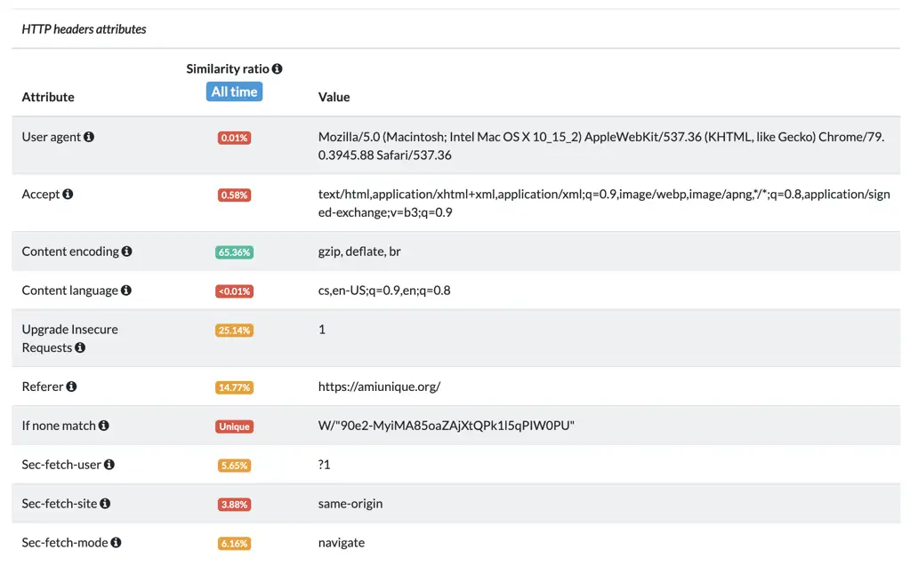
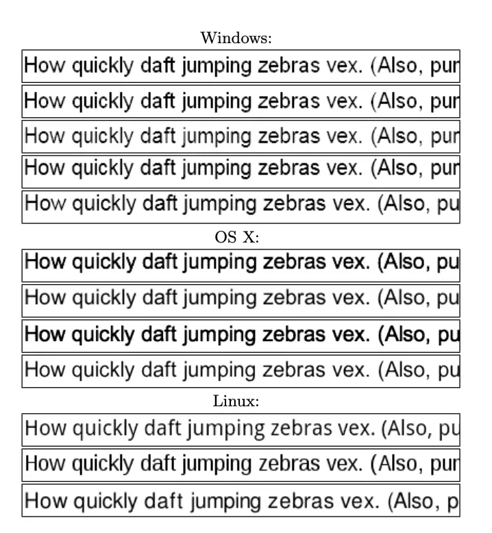
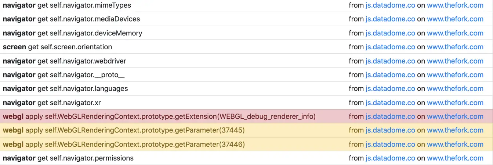

# [](#fingerprinting) Fingerprinting

**Understand browser fingerprinting, an advanced technique used by browsers to track user data and even block bots from accessing them.**

---

Browser fingerprinting is a method that some websites use to collect information about a browser's type and version, as well as the operating system being used, any active plugins, the time zone and language of the machine, the screen resolution, and various other active settings. All of this information is called the **fingerprint** of the browser, and the act of collecting it is called **fingerprinting**.

Yup! Surprisingly enough, browsers provide a lot of information about the user (and even their machine) that is easily accessible to websites! Browser fingerprinting wouldn't even be possible if it weren't for the sheer amount of information browsers provide, and the fact that each fingerprint is unique.

Based on [research](https://www.eff.org/press/archives/2010/05/13) carried out by the Electronic Frontier Foundation, 84% of collected fingerprints are globally exclusive, and they found that the next 9% were in sets with a size of two. They also stated that even though fingerprints are dynamic, new ones can be matched up with old ones with 99.1% correctness. This makes fingerprinting a very viable option for websites who want to track the online behavior of their users in order to serve hyper-personalized advertisements to them. In some cases, it is also used to aid in preventing bots from accessing the websites (or certain sections of it).

## [](#what-makes-up-a-fingerprint) What makes up a fingerprint?

To collect a good fingerprint, websites must collect them from various places.

### [](#from-http-headers) From HTTP headers

There are a few [HTTP headers](../../concepts/http_headers.md) which can be used to create a fingerprint about a user. Here  are some of the main ones:

1. **User-Agent** provides information about the  browser and its operating system (including its versions).
2. **Accept** tells the server what content types the browser can render and send, and **Content-Encoding** provides data about the content compression.
3. **Content-Language** and **Accept-Language** both indicate the user's (and browser's) preferred language.
4. **Referer** gives the server the address of the previous page from which the link was followed.

A few other headers commonly used for fingerprinting can be seen below:



### [](#from-window-properties) From window properties

The `window` is defined as a global variable that is accessible from an JavaScript running in the browser. It is home to a vast amount of functions, variables, and constructors, and most of the global configuration is stored there.

Most of the attributes that are used for fingerprinting are stored under the `window.navigator` object, which holds methods and info about the user's state and identity starting with the **User-Agent** itself and ending with the device's battery status. All of these properties can be used to fingerprint a device; however, most fingerprinting solutions (such as [Valve](https://valve.github.io/fingerprintjs/)) only use the most crucial ones.

Here is a list of some of the most crucial properties on the `window` object used for fingerprinting:

| Property | Example | Description |
| - | - | - |
| `screen.width` | `1680` | Defines the width of the device screen. |
| `screen.height` | `1050` | Defines the height of the device screen. |
| `screen.availWidth` | `1680` | The portion of the screen width available to the browser window. |
| `screen.availHeight` | `1050` | The portion of the screen height available to the browser window. |
| `navigator.userAgent` | `'Mozilla/5.0 (X11; Linux x86_64; rv:90.0) Gecko/20100101 Firefox/90.0'` | Same as the HTTP header. |
| `navigator.platform` | `'MacIntel'` | The platform the browser is running on. |
| `navigator.cookieEnabled` | `true` | Whether or not the browser accepts cookies. |
| `navigator.doNotTrack` | `'1'` | Indicates the browser's Do Not Track settings. |
| `navigator.buildID` | `20181001000000` | The build ID of the browser. |
| `navigator.product` | `'Gecko'` | The layout engine used. |
| `navigator.productSub` | `20030107` | The version of the layout engine used. |
| `navigator.vendor` | `'Google Inc.'` | Vendor of the browser. |
| `navigator.hardwareConcurrency` | `4` | The number of logical processors the user's computer has available to run threads on. |
| `navigator.javaEnabled` | `false` | Whether or not the user has enabled Java. |
| `navigator.deviceMemory` | `8` | Approximately the amount of user memory (in gigabytes). |
| `navigator.language` | `'en-US'` | The user's primary language. |
| `navigator.languages` | `['en-US', 'cs-CZ', 'es']` | Other user languages. |

### [](#from-function-calls) From function calls

Fingerprinting tools can also collect pieces of information that are retrieved by calling specific functions:

```js
// Get the WebGL vendor information
WebGLRenderingContext.getParameter(37445)

// Get the WebGL renderer information
WebGLRenderingContext.getParameter(37446)

// Pass any codec into this function (ex. "audio/aac"). It will return
// either "maybe," "probably," or "" indicating whether
// or not the browser can play that codec. An empty
// string means that  it can't be played.
HTMLMediaElement.canPlayType('some/codec')

// can ask for a permission if it is not already enabled.
// allows you to know which permissions the user has
// enabled, and which are disabled
navigator.permissions.query('some_permission')
```

### [](#with-canvases) With canvases

This technique is based on rendering [WebGL](https://developer.mozilla.org/en-US/docs/Web/API/WebGL_API) scenes to a canvas element and observing the pixels rendered. WebGL rendering is tightly connected with the hardware, and therefore provides high entropy. Here's a quick breakdown of how it works:

1. A JavaScript script creates a [`<canvas>` element](https://developer.mozilla.org/en-US/docs/Web/API/Canvas_API) and renders some font or a custom shape.
2. The script then gets the pixel-map from the `<canvas>` element.
3. The collected pixel-map is stored in a cryptographic hash specific to the device's hardware.

Canvas fingerprinting takes advantage of the CSS3 feature for importing fonts into CSS (called [WebFonts](https://developer.mozilla.org/en-US/docs/Learn/CSS/Styling_text/Web_fonts)). This means it's not required to use just the machine's preinstalled fonts.

Here's an example of multiple WebGL scenes visibly being rendered differently on different machines:



### [](#from-audiocontext) From AudioContext

The [AudioContext](https://developer.mozilla.org/en-US/docs/Web/API/AudioContext) API represents an audio-processing graph built from audio modules linked together, each represented by an [AudioNode](https://developer.mozilla.org/en-US/docs/Web/API/AudioNode) ([OscillatorNode](https://developer.mozilla.org/en-US/docs/Web/API/OscillatorNode)).

In the simplest cases, the fingerprint can be obtained by simply checking for the existence of AudioContext. However, this doesn't provide very much information. In advanced cases, the technique used to collect a fingerprint from AudioContext is quite similar to the `<canvas>` method:

1. Audio is passed through an OscillatorNode.
2. The signal is processed and collected.
3. The collected signal is cryptographically hashed to provide a short ID.

> A downfall of this method is that two same machines with the same browser will get the same ID.

### [](#from-batterymanager) From BatteryManager

The `navigator.getBattery()` function returns a promise which resolves with a [BatteryManager](https://developer.mozilla.org/en-US/docs/Web/API/BatteryManager) interface. BatteryManager offers information about whether or not the battery is charging, and how much time is left until the battery has fully discharged/charged.

On its own this method is quite weak, but it can be potent when combined with the `<canvas>` and AudioContext fingerprinting techniques mentioned above.

## [](#fingerprint-example) Fingerprint example

When all is said and done, this is what a browser fingerprint might look like:

```json
{
  "userAgent": "Mozilla/5.0 (X11; Linux x86_64; rv:90.0) Gecko/20100101 Firefox/90.0",
  "cookiesEnabled": true,
  "timezone": "Europe/Prague",
  "timezoneOffset": -60,
  "audioCodecs": {
    "ogg": "probably",
    "mp3": "maybe",
    "wav": "probably",
    "m4a": "maybe",
    "aac": "maybe"
  },
  "videoCodecs": {
    "ogg": "probably", 
    "h264": "probably", 
    "webm": "probably"
  },
  "videoCard": [
    "Intel Open Source Technology Center",
    "Mesa DRI Intel(R) HD Graphics 4600 (HSW GT2)"
  ],
  "productSub": "20100101",
  "hardwareConcurrency": 8,
  "multimediaDevices": { 
    "speakers": 0, 
    "micros": 0, 
    "webcams": 0
  },
  "platform": "Linux x86_64",
  "pluginsSupport": true,
  "screenResolution": [ 1920, 1080 ],
  "availableScreenResolution": [ 1920, 1080 ],
  "colorDepth": 24,
  "touchSupport": { 
    "maxTouchPoints": 0, 
    "touchEvent": false, 
    "touchStart": false
  },
  "languages": [ "en-US", "en" ]
}
```

## [](#how-it-works) How it works

There are multiple levels and different approaches sites take to collect browser fingerprints; however, they all have one thing in common: they are using a script written in JavaScript to evaluate the target browser's context and collect information about it (often times also storing it in their database, or in a cookie). These scripts are often obfuscated and difficult to track down and understand, especially if they are anti-bot scripts.

There are multiple levels of script obfuscation that are used to make fingerprinting scripts unreadable and hard to find:

### Randomization

The script is modified with some random JavaScript elements. There is usually a random number of whitespaces and other strange formatting characters. Some variable and function names are also changed into somewhat cryptic strings without any readable meaning.

### Data obfuscation

There are two main data obfuscation techniques which are widely used:

1. **String splitting** uses the concatenation of multiple substrings. It is mostly used alongside an `eval()` or `document.write()`.
2. **Keyword replacement** allows the script to mask the accessed properties. This allows the script to have a random order of the substrings and makes it harder to detect.

Often times, both of these data obfuscation techniques are used together.

### Encoding

Built-in JavaScript encoding functions are used to transform the code into, for example, hexadecimal string. Or, a custom encoding function is used and a custom decoding function decodes the code as it is evaluated in the browser.

## Detecting fingerprinting scripts

As mentioned above, many sites obfuscate their fingerprinting scripts to make them harder to detect. Luckily for us, there are ways around this.

### Manual de-obfuscation

Almost all sites using fingerprinting and tracking scripts try to protect them as much as much as they can. However, it is impossible to make client-side JavaScript immune to reverse engineering. It is only possible to make reverse engineering difficult and unpleasant for the developer. The procedure used to make the code as unreadable as possible is called [obfuscation](https://www.techtarget.com/searchsecurity/definition/obfuscation#:~:text=Obfuscation%20means%20to%20make%20something,code%20is%20one%20obfuscation%20method.).

When you want to dig inside the protection code to determine exactly which data is collected, you will probably have to deobfuscate it. Be aware that this can be a very time-consuming process. Code deobfuscation can take anywhere up to 1-2-days to be at a semi-readable state.

We recommend watching some videos from [Jarrod Overson on YouTube](https://www.youtube.com/channel/UCJbZGfomrHtwpdjrARoMVaA/videos) to learn the tooling necessary to deobfuscate code.

### Using browser extensions

Because of how common it has become to obfuscate fingerprinting scripts, there are many extensions help identify fingerprinting scripts due to the fact that browser fingerprinting is such a big privacy question. Browser extensions such as [**Don't Fingerprint Me**](https://github.com/freethenation/DFPM) have been created to help detect them. In the extension's window, you can see a report on which functions commonly used for fingerprinting have been called, and which navigator properties have been accessed.



This extension provides monitoring of only a few critical attributes, but in order to to deceive anti-scraping protections, the full list is needed. However, the extension does reveal the scripts that collect the fingerprints.

## [](#anti-bot-fingerprinting) Anti-bot fingerprinting

On websites which implement advanced fingerprinting techniques, they will tie the fingerprint and certain headers (such as the **User-Agent** header) to the IP address of the user. These sites will block a user (or scraper) if it made a request with one fingerprint and set of headers, then tries to make another request on the same proxy but with a different fingerprint.

When dealing with these cases, it's important to sync the generation of headers and fingerprints with the rotation of proxies (this is known as session rotation).

## [](#next) Next up

[Next up](./geolocation.md), we'll be covering **geolocation** methods that websites use to grab the location from which a request has been made, and how they relate to anti-scraping.
