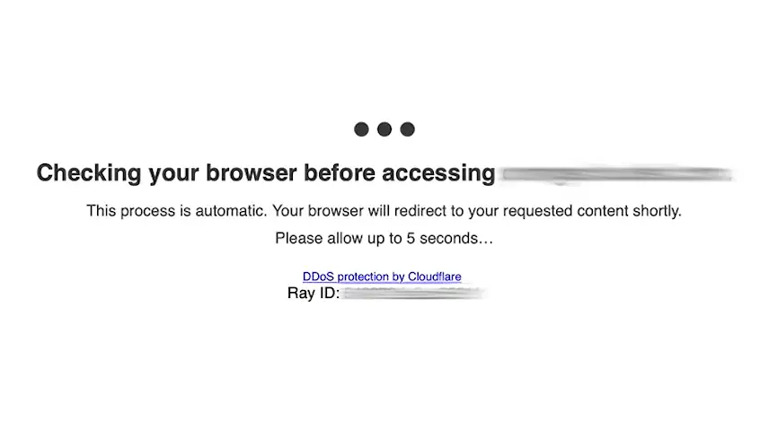
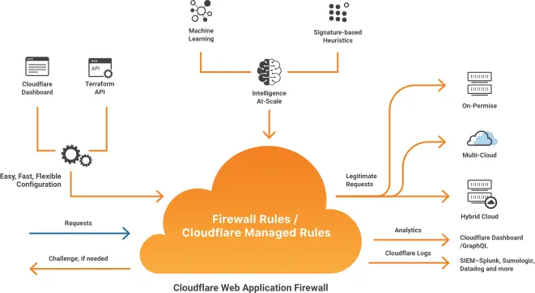

#  Firewalls

**Understand what a web-application firewall is, how they work, and the various common techniques for avoiding them altogether.**

---

A web-application firewall (or **WAF**) is a tool for website admins which allows them to set various access rules for their visitors. The rules can vary on each website and are usually hard to detect; therefore, on sites using a WAF, you need to run a set of tests to test the rules and find out their limits.

One of the most common WAFs one can come across is the one from [Cloudflare](https://www.cloudflare.com). It allows setting a waiting screen that runs a few tests against the visitor to detect a genuine visitor or a bot. However, not all WAFs are that easy to detect.

##  How it works

WAPs work on a similar premise as regular firewalls. Web admins define the rules, and the firewall executes them. As an example of how the WAF can work, we will take a look at Cloudflare's solution:

1. The visitor sends a request to the webpage.
2. Request is intercepted by the firewall.
3. The firewall decides if presenting a challenge (captcha) is necessary. If the user already solved a captcha in the past or nothing is suspicious, it will immediately forward the request to the application's server.
4. A captcha is presented which must be solved. Once it is solved, a [cookie](../../concepts/http_cookies.md) is stored in the visitor's browser.
5. The request is forwarded to the application's server.

Since there are multiple providers, it is essential to say that the challenges are not always graphical and can be entirely server-side (without any JavaScript evaluation in the visitor browser).

##  Bypassing web-application firewalls

- Using [proxies](../mitigation/proxies.md).
- Mocking [headers](../../concepts/http_headers.md).
- Overriding the browser's [fingerprint](./fingerprinting.md) (most effective).
- Farming the [cookies](../../concepts/http_cookies.md) from a website with a headless browser, then using the farmed cookies to do HTTP based scraping (most performant).

As you likely already know, there is no solution that fits all. If you are struggling to get past a WAP provider, you can try using Firefox with Playwright.

##  Next up

In the [next lesson](./captchas.md), we'll be covering **captchas**, which were mentioned throughout this lesson. It's important to note that attempting to solve a captcha programmatically is the last resort - always try to avoid being presented the captcha in the first place by using the techniques mentioned in this lesson.
