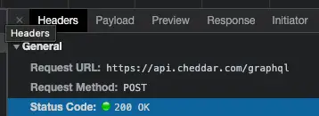

#  GraphQL scraping

[GraphQL](https://graphql.org/) APIs different from the regular [REST](https://www.redhat.com/en/topics/api/what-is-a-rest-api)ful APIs you're likely familiar with, which means that different methods and tooling are used to scrape them. This course will teach you everything you need to know about GraphQL to scrape an API built with it.

##  How do I know if it's a GraphQL API?

In this section, we'll be scraping [cheddar.com](https://cheddar.com)'s GraphQL API. When you visit the website and make a search for anything while your **Network Tab** is open, you'll see a request that has been sent to the endpoint **api.cheddar.com/graphql**.

As a rule of thumb, when the endpoint ends with **/graphql** and it's a **POST** request, it's a 99.99% bulletproof indicator that the target site is using GraphQL. If you want to be 100% certain though, taking a look at the request payload will most definitely give it away.

Every GraphQL payload will be a JSON object with a **query** property, and a **variables** property if any variables were provided. If you take a closer look at the full **query** property of this request, you'll notice that it's stringified GraphQL language content.

##  Advantages & disadvantages

We already discussed the advantages and disadvantages of API scraping in general in this course's introduction, but because GraphQL is such a different technology, scraping an API built with it comes with its own pros and cons.

### Advantages

1. GraphQL allows you as the developer to choose which fields you'd like to be returned back to you. Not only does this leave you with only the data you want and no extra unwanted fields, but it is also easier on the target.

2. Allows access to data that is not readily available natively through the website.

3. Queries are heavily customizable due to features like **fragments**.

### Disadvantages

1. Though it's a fantastic technology with lots of awesome features, it is also more complex to understand.

2. GraphQL [introspection](./introspection.md) is disabled on many sites, which makes it more difficult to reap the full benefits of GraphQL.

##  Next up

This course section's [first lesson](./modifying_variables.md) will be discussing how to customize GraphQL queries without ever having to write any GraphQL language.
