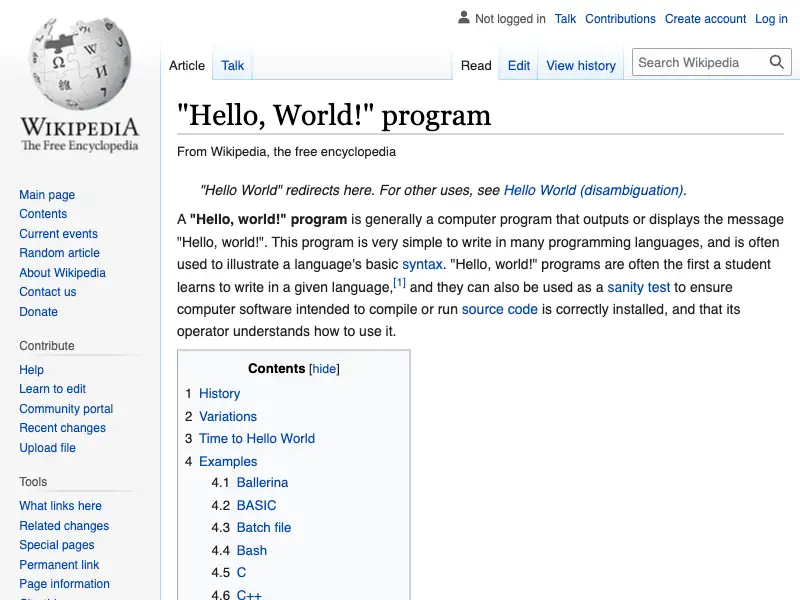

# [](#page-methods) Page methods

Other than having methods for interacting with a page and waiting for events and elements, the **Page** object also supports various methods for doing other things, such as [reloading](https://pptr.dev/#?product=Puppeteer&version=v13.7.0&show=api-pagereloadoptions), [screenshotting](https://playwright.dev/docs/api/class-page#page-screenshot), [changing headers](https://playwright.dev/docs/api/class-page#page-set-extra-http-headers), and collecting the [page's content](https://pptr.dev/#?product=Puppeteer&version=v13.7.0&show=api-pagecontent).

Last lesson, we left off at a point where we are waiting for the page to navigate so that we can collect the page's title and take a screenshot of it. In this lesson, we'll be learning about the two methods we can use to easily achieve both of those things.

## [](#grabbing-the-title) Grabbing the title

There are two main page functions which will return general data:

1. `page.content()` will return the entire HTML content of the page.
2. `page.title()` will return the title of the current page found in the `<title>` tag.

For our case, we'll utilize the `page.title()` function to grab the title and log it to the console:

```js
// Grab the title and set it to a variable
const title = await page.title();

// Log the title to the console
console.log(title);
```

## [](#screenshotting) Screenshotting

The `page.screenshot()` function will return a buffer which can be written to the filesystem as an image:

```js
// Take the screenshot and write it to the filesystem
await page.screenshot({ path: 'screenshot.png' });
```

> The image will by default be **.png**. To change the image to **.jpeg** type, set the (optional) `type` option to **jpeg**.

## [](#final-code) Final code

Here's our final code which extracts the page's title, takes a screenshot and saves it to our project's folder as `screenshot.png`:

```marked-tabs
<marked-tab header="Playwright" lang="javascript">
import { chromium } from 'playwright';

const browser = await chromium.launch({ headless: false });

// Create a page and visit Google
const page = await browser.newPage();
await page.goto('https://google.com');

// Agree to the cookies policy
await page.click('button:has-text("I agree")');

// Type the query and visit the results page
await page.type('input[title="Search"]', 'hello world');
await page.keyboard.press('Enter');

// Click on the first result
await page.click('.g a');
await page.waitForLoadState('load');

// Grab the page's title and log it to the console
const title = await page.title();
console.log(title);

// Take a screenshot and write it to the filesystem
await page.screenshot({ path: 'screenshot.png' });

await browser.close();
</marked-tab>
<marked-tab header="Puppeteer" lang="javascript">
import puppeteer from 'puppeteer';

const browser = await puppeteer.launch({ headless: false });

// Create a page and visit Google
const page = await browser.newPage();
await page.goto('https://google.com');

// Agree to the cookies policy
await page.click('button + button');

// Type the query and visit the results page
await page.type('input[title="Search"]', 'hello world');
await page.keyboard.press('Enter');

// Wait for the first result to appear on the page,
// then click on it
await page.waitForSelector('.g a');
await Promise.all([page.waitForNavigation(), page.click('.g a')]);

// Grab the page's title and log it to the console
const title = await page.title();
console.log(title);

// Take a screenshot and write it to the filesystem
await page.screenshot({ path: 'screenshot.png' });

await browser.close();
</marked-tab>
```

When you run this code, you should see this logged to console:

```text
"Hello, World!" program - Wikipedia
```

Additionally, you should see a new image named **screenshot.png** in your project's folder that looks something like this:



## [](#next) Next up

In the [next exciting lesson]({{@link puppeteer_playwright/executing_scripts.md}}), we'll gain a solid understanding of the two different contexts we can run our code in when using Puppeteer and Playwright, as well as how to run code in the context of the browser.
