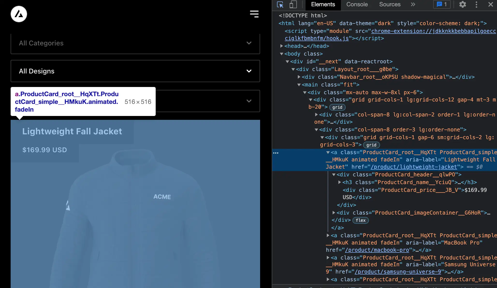
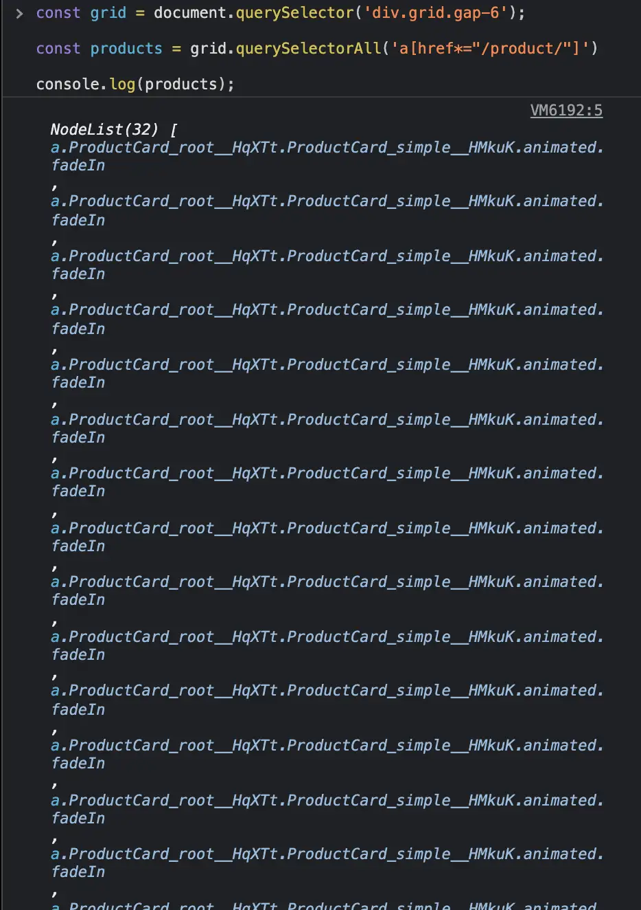

# [](#devtools-data-collection) Data collection with DevTools

We know the basics of HTML, CSS, JavaScript and DevTools and we can finally try doing something more practical - collecting data from a website. Let's try collecting the on-sale products from [this fake e-commerce website](https://demo-webstore.apify.org/). We will use CSS selectors, JavaScript, and DevTools to achieve this task.

## [](#getting-structured-data) Getting structured data from HTML

When you open up the [on-sale section of Fakestore](https://demo-webstore.apify.org/search/on-sale), you'll see that there's a grid of products on the page with names and pictures of products. We will now learn how to collect all this information. Open DevTools and select the first product with the selector tool.


Now you know where to find the name of one of the products in the page's HTML, but we want to find all information about this product. To do that, in the **Elements** tab, hover over the elements above the one you just found, until you find the element that contains all the data about the selected product. Alternatively, you can press the up arrow a few times to get the same result.



This element is the parent element of all the nested (child) elements, and we can find it using JavaScript and collect the data. Notice that the element has an `aria-label` attribute, as well as multiple `class` attributes. This is where CSS selectors become handy, because we can use them to select an element with a specific class.

> Websites change and the structure or their HTML or the CSS selectors can become outdated. We'll try our best to keep this course updated, but if you find that what you see on the website doesn't match this guide exactly, don't worry. Everything will work exactly the same. You will only have to use whatever you see on your screen and not in the screenshots here.

## [](#selecting-elements) Selecting elements with JavaScript

We know how to find an element manually using the DevTools, but for automated scraping, we need to tell the computer how to find it as well. We can do that using JavaScript and CSS selectors.

The function to do that is called `document.querySelector('some-selector')` and it will find the first element in the page's HTML matching the provided CSS selector. For example `document.querySelector('div')` will find the first `<div>` element. And `document.querySelector('p.my-class')` will find the first `<p>` element with the class `my-class`.

> You can find available CSS selectors and their syntax on the [MDN CSS Selectors page](https://developer.mozilla.org/en-US/docs/Web/CSS/CSS_Selectors).

At the time of writing, the HTML element that contained all the data we wanted had an `<a>` tag and a `animated fadeIn` class, plus an `aria-label` attribute. This actually means that there were two classes applied to the element - `animated` and `fadeIn`. Neither of these seem reliable classes to go off of; however, each element also includes an `href` attribute which includes `/product/`, which we can use to our advantage.

```js
document.querySelector('a[aria-label][href*="/product/"]');
```


> There are always multiple ways to select an element using CSS selectors. We always try to choose the one that seems the most reliable, precise, and unlikely to change with website updates. For example the `href` attribute can be assumed to always include `/products/`, as this is the path to view a specific product.

## [](#collecting-from-elements) Collecting data from elements

Now that we found the element, we can start poking into it to collect data. First, let's save the element to a variable so that we can work with it repeatedly and then print its text content to the console.

```js
const product = document.querySelector('a[href*="/product/"]');
console.log(product.textContent);
```

Here, we are using a special selector. Normally, if you use a selector like `a[href]`, all `<a>` tags with a `href` attribute will be matched. By adding an `=` and a value (`a[href="something"]`), you match all `<a>` elements with the exact `href` value specified. Using the `*` before the `=` allows us to match any elements where the `href` attribute **includes** the specified value, rather than strictly equals it. There are many `<a>` tags on our page, but we only want the ones that lead to a path including `/product/`, which is why we've chosen to use this selector.


As you can see, we were able to collect the data, but the format is still not very useful - there's a whole lot of weird data there that we probably don't need. For further processing (ex. in a spreadsheet), we would like to have each piece of data as a separate field (column). To do that, we will look at the HTML structure in more detail.

### [](#selecting-child-elements) Selecting child elements

In the [Getting structured data from HTML](#getting-structured-data-from-html) section, we were hovering over the elements in the **Elements** tab to find the element that contains all the data. We can use that to find the individual data points as well. After a bit more inspection, we discover that the product's title is a `<span>` tag with a parent `<h3>` element, and the price is held inside a `<div>` with a `class` attribute including the keyword of **price**.

> Don't forget that the selectors may have changed, but the general principle of finding them will always be the same. Use what you see on your screen.


The `document.querySelector()` function looks for a specific element in the whole HTML `document`, so if we called it with `h3`, it would find the first `<h3>` node in the `document`. Luckily we can also use this function to look for elements within an element.

There's a similar function called [`querySelectorAll()`](https://javascript.info/searching-elements-dom#querySelectorAll) that returns collection of all the elements matching the selector - not just the first one. We will use this function to grab all the elements holding our sought after data.

> Learn more about `Arrays` in [this tutorial](https://javascript.info/array).

Let's find the parent element of all of the products, which matches the selector `div.grid.gap-6`, select it with `document.querySelector()`, then find all of the product elements.

```js
const grid = document.querySelector('div.grid.gap-6');

const products = grid.querySelectorAll('a[href*="/product/"]')

console.log(products);
```

There are 32 products on the page, so if we've done this correctly, a list of 32 product elements should be logged to the console.



### [](#collecting-data) Collecting data

The `products` array now contains all the elements we need, and we can access each one's data individually. Let's save the title and price of the first product into an [object](https://javascript.info/object). Those of you who know JavaScript will know that this is not the prettiest code ever written, but it is beginner-friendly and that's important here. We will also use the `.trim()` function to remove unnecessary whitespace from the results.

```js
const result = {
    title: products[0].querySelector('h3').textContent.trim(),
    price: products[0].querySelector('div[class*="price"]').textContent.trim(),
};

console.log(result);
```


If you were able to get the same result in your browser console, congratulations! You successfully collected your first data. If not, don't worry and review your code carefully. You'll crush the bug soon enough.

## [](#next) Next up

We have learned how to collect information about a few products from an e-commerce website. In the [next lesson](./devtools_continued.md), we will learn how to collect all of them.
