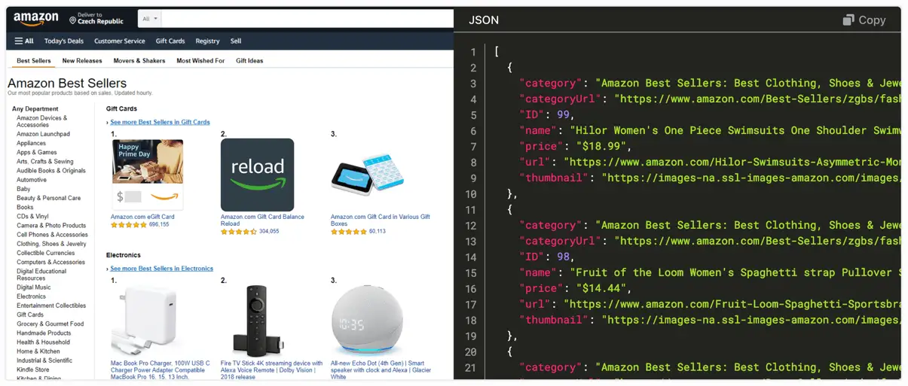

#  Introduction

Web scraping or crawling? Data collection, mining, or extraction? You can find various definitions on the web. Let's agree on simple explanations that we will use throughout this beginner course on web scraping.

##  What is data collection?

For us, data collection is a process that takes a web page, like an Amazon product page, and collects useful information from the page, such as the product's name and price. Web pages are an unstructured data source and the goal of data collection is to make the information structured and readable to computers. The main sources of data on a web page are HTML documents and API calls, but also images, PDFs, and so on.

##  What is crawling?

Where data collection focuses on a single page, web crawling (sometimes called spidering 🕷) is all about movement between pages or websites. The purpose of crawling is to travel across the website to find pages with the information we want. Crawling and collection can happen simultaneously, while moving from page to page, or separately, where one scraper focuses solely on finding pages with data and another scraper collects the data. The main purpose of crawling is to collect URLs or other identifiers that can be used to move around.

<!-- TODO: An illustration of moving between pages -->

##  What is web scraping?

We use web scraping as a general term for crawling, collection and all other activities that have the purpose of converting unstructured data from the web to a structured format. In the advanced courses, you'll learn that modern web scraping is about much more than just HTML and URLs.

<!-- TODO: An illustration of moving between pages and collecting data -->

##  Next up

In the [next lesson]({{@link web_scraping_for_beginners/data_collection.md}}), you will learn about the basic building blocks of each web page. HTML, CSS and JavaScript.
