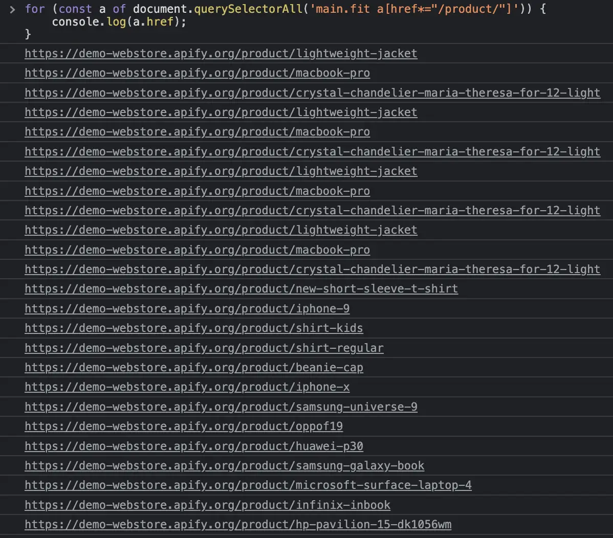

# [](#filtering-links) Filtering links

**When you collect links from a web page, you often end up with a lot of irrelevant URLs. Learn how to filter the links to only keep the ones you need.**

---

Web pages are full of links, but frankly, most of them are useless to us. There are two approaches to filtering links: Targeting the links we're interested in by using unique CSS selectors, and collecting all links and then using pattern matching to find the sought after URLs. In real scraping scenarios, both of these two approaches are often combined for the most effective URL filtering.

## [](#css-filtering) Filtering with unique CSS selectors

In the previous lesson, we simply grabbed all the links from the HTML document.

```marked-tabs
<marked-tab header="DevTools" lang="javascript">
document.querySelectorAll('a');
</marked-tab>
<marked-tab header="Node.js with Cheerio" lang="javascript">
$('a');
</marked-tab>
```

### [](#attribute-selector) Attribute selector

That's not the only way to do it, however. Since we're interested in the `href` attributes, a first very reasonable filter is to exclusively target the `<a>` tags that have the `href` attribute (yes, anchor tags without the attribute can and do exist). You can do that by using the [CSS attribute selector](https://developer.mozilla.org/en-US/docs/Web/CSS/Attribute_selectors).

```marked-tabs
<marked-tab header="DevTools" lang="javascript">
document.querySelectorAll('a[href]');
</marked-tab>
<marked-tab header="Node.js" lang="javascript">
$('a[href]');
</marked-tab>
```

Ensuring to always add the `[href]` part of the selector will save you from nasty bug hunts on certain pages.

We only want the product links on this page, so we can limit the number of results by only targeting the links within the `main.fit` container to filter out some unwanted links (such as in the navbar), then further select any a tags with a `href` attribute containing `/product/`.

### [](#descendant-selector) Descendant selector

```marked-tabs
<marked-tab header="DevTools" lang="javascript">
document.querySelectorAll('main.fit a[href*="/product/"]');
</marked-tab>
<marked-tab header="Node.js" lang="javascript">
$('main.fit a[href*="/product/"]');
</marked-tab>
```

We already know both the `main.fit` and `a[href*="/product/"]` selectors and how they work on their own, but their combination is new. It's called a [descendant selector](https://css-tricks.com/almanac/selectors/d/descendant/), and it selects all `<a href=".../product/...">` elements that are descendants of a `<main class="fit">` element. A descendant is any element that's nested somewhere inside another element. It does not have to be a direct child of the specified parent element.


When we print all the URLs in the DevTools console, we can see that we've correctly filtered only the featured product links.

```js
for (const a of document.querySelectorAll('main.fit a[href*="/product/"]')) {
    console.log(a.href);
}
```



Notice that we might have some duplicate URLs. These duplicates can be easily filtered out. _We will be learning about data filtering/manipulation in future lessons._

## [](#pattern-matching-filter) Filtering with pattern-matching

Another common way to filter links (or any text, really) is by matching patterns with regular expressions.

> [Learn more about regular expressions](https://javascript.info/regexp-introduction)

We can inspect the product URLs, and we'll soon find that they all look like the following. That is, they're exactly the same except for the text after the final `/`.

```text
https://demo-webstore.apify.org/product/crystal-chandelier-maria-theresa-for-12-light
https://demo-webstore.apify.org/product/macbook-pro
https://demo-webstore.apify.org/product/lightweight-jacket
...
https://demo-webstore.apify.org/product/{PRODUCT-NAME}
```

Now, we'll create a regular expression that matches those links. There are many ways to do this. For simplicity, let's go with this one:

```RegExp
demo-webstore\.apify\.org\/product\/[a-z|0-9|-]*
```

This regular expression matches all URLs that include the `demo-webstore.apify.org/product/` substring immediately following with any number of letters or dashes `-`.

> A great way to learn more about regular expression syntax and to test your expressions are tools like [regex101.com](https://regex101.com/) or [regexr.com](https://regexr.com/). It's okay if you don't get the hang of it right away!

To test our regular expression in the DevTools console, we'll first create a [`RegExp`](https://developer.mozilla.org/en-US/docs/Web/JavaScript/Reference/Global_Objects/RegExp) object and then test the URLs with the [`regExp.test(string)`](https://developer.mozilla.org/en-US/docs/Web/JavaScript/Reference/Global_Objects/RegExp/test) function.

```js
// To demonstrate pattern matching, we use only the 'a'
// selector to select all links on the page.
for (const a of document.querySelectorAll('a')) {
    const regExp = /demo-webstore\.apify\.org\/product\/[a-z|0-9|-]*/;
    const url = a.href;
    if (regExp.test(url)) console.log(url);
}
```

If you run this code in DevTools, you'll see that it produces exactly the same URLs as the CSS filter did.

> Yes, filtering with CSS selectors is often the better (and just slightly more performant) option. But sometimes, it's not enough. Learning regular expressions is a very useful skill in many scenarios.

## [](#next) Next Up

In the [next lesson](./relative_urls.md) we'll see how rewriting this code to Node.js is not so simple and learn about absolute and relative URLs in the process.
