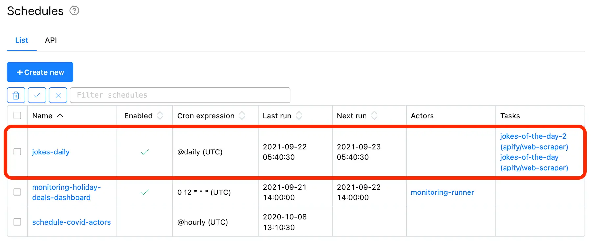
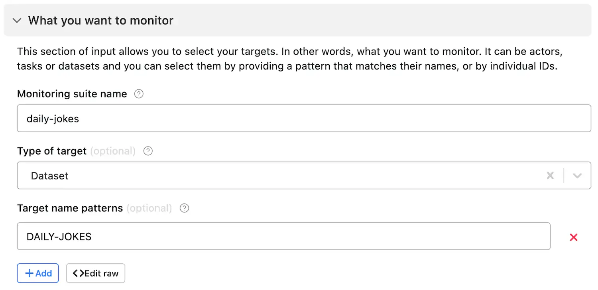
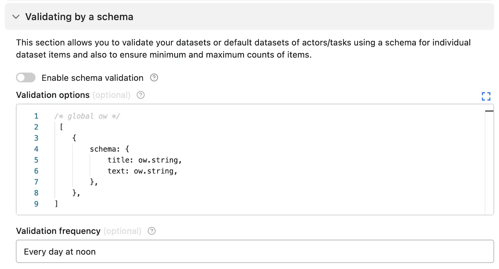
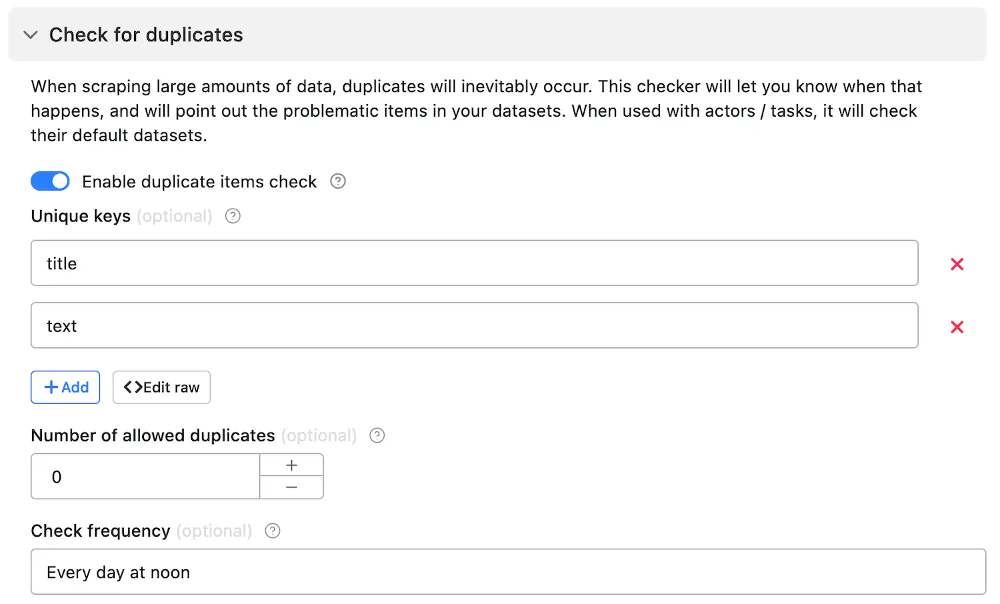

#  Monitor shared named datasets

This example walks you through setting up [monitoring](https://apify.com/apify/monitoring) for a [dataset](../storage/dataset.md) add data.

##  Use case

You have two or more [actors](../../academy/getting_started/actors.md).

You need:

- Data to always be in the [correct format](#validate-data).
- Alerts if items are [duplicated](#check-for-duplicates).
- [Notification]({{@link monitoring.md#notifications}}) when your scheduled run finishes successfully.
- [Data visualization](#set-up-data-visualization) on a simple dashboard.

For this use case, we will imagine you want to scrape fresh jokes from two websites and [store them in a single named dataset](../storage/dataset.md) daily.

You created two tasks from **Web Scraper** ([apify/web-scraper](https://apify.com/apify/web-scraper)) and set them to save the results in the desired dataset. Next, you need to test (validate/verify) your data to make sure it fits your needs. To avoid creating separate software that will do this, you can use our [monitoring suite](https://apify.com/apify/monitoring).

Each of the above tasks handles a different website. After the tasks finish successfully, they call the monitoring actor using a [webhook](../integrations/webhooks.md) that handles the data aggregation.

The two extraction tasks are [scheduled](../schedules.md) to run every day using the `@daily` [cron](https://crontab.guru) expression. They produce a new named dataset each day. The [naming convention](https://en.wikipedia.org/wiki/Naming_convention_(programming)) for the dataset is `DAILY-JOKES-<DateOfTheDay>`.

Now, to the monitoring part. For this tutorial, let's skip the monitoring of the tasks and jump right to the dataset.

##  Create a new monitoring task

If you haven't already, [add the monitoring suite to your account]({{@link monitoring.md#add-the-monitoring-suite-to-your-account}}).

If you have already added the task, under its **Settings** tab, give it a name. For example, **monitoring-jokes**.

> We recommend prefixing your monitoring task names with **monitoring-** so you could identify them easier.

Next, we will configure the monitoring suite.

##  Monitoring configuration

1. Under your task's **Input** tab, set the **Mode** dropdown to **Create configuration**.

2. Next, open the **What you want to monitor** section. Give the monitoring suite a name in the **Monitoring suite name** field, e.g. **daily-jokes**.

3. In the **Type of target:** dropdown, select **Dataset**, since you will be monitoring a shared dataset.

4. **Target name patterns** should be the name of your dataset, **DAILY-JOKES**. If you want to use a more strict pattern, you can use **^DAILY-JOKES**.

5. Select the **Notify me whenever actor/task does not succeed** option to receive a report when a run finishes unsuccessfully.

> Each of your monitoring suites must have a unique name.

Your configuration will look like this:

##  Validate data

Now, let's ensure that your jokes are in the correct form. Each joke's dataset item should contain a `title` and `text`. Both values should be [strings](https://developer.mozilla.org/en-US/docs/Web/JavaScript/Reference/Global_Objects/String).

1. Open the **Validating by a schema** section and select the **Enable schema validation** option.

2. In the **Validation options** field, create an [object](https://javascript.info/object) containing a `schema` key. As its value, set an object specifying the format of each of the properties you want to validate.

3. Make sure you set **Validation frequency** to something other than **Per run** because datasets don't have runs. You can use [natural language cron expressions](https://github.com/darkeyedevelopers/natural-cron.js), so in this instance, you can set frequency to **Every day at noon**.

The monitoring suite uses the [ow](https://www.npmjs.com/package/ow) library for type validation. Make sure to import the library using `/* global ow */`.

##  Check for duplicates

1. In the **Check for duplicates** section, select the **Enable duplicate items check** option.

2. Set the first **Unique keys** field to `title`. Click **Add** and set the second field to `text`. This will ensure that the titles and jokes are unique.

3. Just like with validation frequency, set the **Check frequency** to something other than **Per run** (check step 3 for tips).

##  Set up data visualization

You can configure data visualization in the **Statistics dashboard** section. To enable it, check the **Enable dashboard** option.

