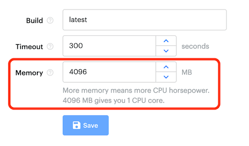
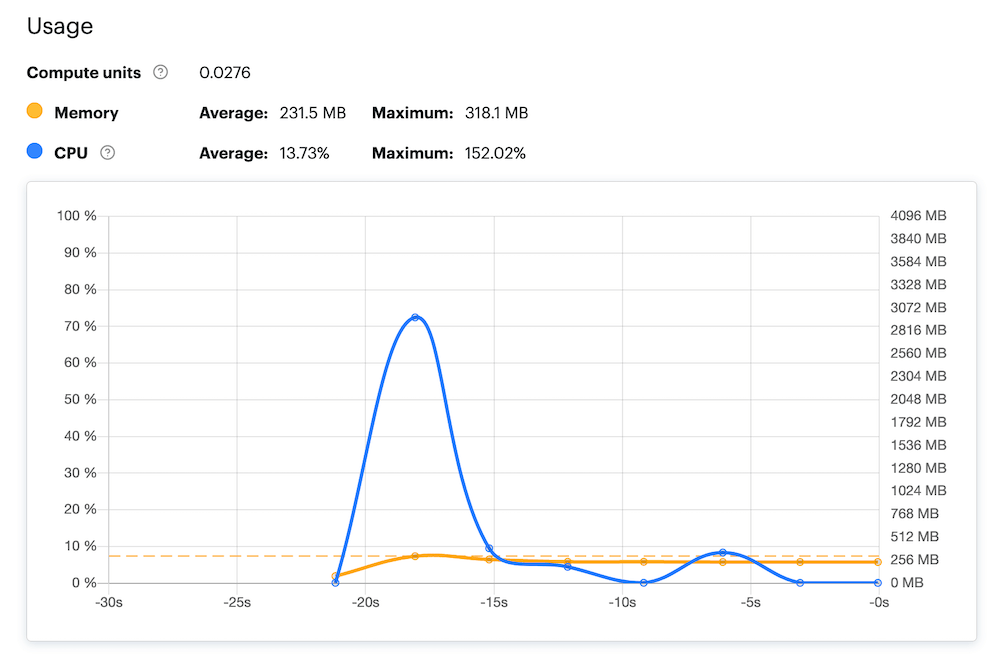

# Memory and CPU

**Learn about your actors' memory and processing power requirements, their relationship with Docker resources, and minimum requirements for different use cases.**

---

[Actors](../index.md) run in
[Docker containers](https://www.docker.com/resources/what-container),
which have a [limited amount of resources](https://phoenixnap.com/kb/docker-memory-and-cpu-limit). When starting, the actor needs to be allocated a certain share of those resources, such as how much CPU "horsepower" it will be able to use.

By assigning an actor's **memory** capacity, you also assign it a proportional amount of **CPU power**. Every CPU core corresponds to 4 GB of memory. So, 512 MB = 1/8th of a core, 1 GB = 1/4 of core, 8 GB gives you 2 cores, and so on.

In addition to CPU power, the memory allocation also influences disk size, which amounts to 2x the allocated memory.

## Memory requirements

Each use case has its own minimum memory requirements. The larger and more complex your project, the more memory/CPU power it will require. Some examples which have minimum requirements are:

- Actors using [Puppeteer](https://pptr.dev/): at least 1GB of memory.

- Large and complex sites like [Google Maps](https://apify.com/drobnikj/crawler-google-places): at least 4GB for optimal speed and [concurrency](https://crawlee.dev/api/core/class/AutoscaledPool#minConcurrency).

- Working with a large amount of data in memory.

## How much memory should you allocate?

Actors built on top of the [Apify SDK](https://docs.apify.com/sdk-js) and [Crawlee](https://crawlee.dev/) use autoscaling. This means that they will always run as efficiently as they can with the memory they have allocated. So, if you allocate 2 times more memory, the run should be 2 times faster and consume the same amount of compute units (1 * 1 = 0.5 * 2).

A good middle ground to start is 4096 MB. If you need the results faster, increase the memory (bear in mind the [next point](#maximum-memory), though). You can also try decreasing it to lower the pressure on the target site.

Autoscaling only applies to solutions that run multiple tasks (URLs) for at least 30 seconds. If you need to scrape just one URL or use actors like [Google Sheets](https://apify.com/lukaskrivka/google-sheets) that do just a single isolated job, we recommend you lower the memory

### Maximum memory

Apify actors are most commonly written in [Node.js](https://nodejs.org/en/), which uses a [single process thread](https://betterprogramming.pub/is-node-js-really-single-threaded-7ea59bcc8d64). Unless you use external binaries such as the Chrome browser, Puppeteer, or other multi-threaded libraries you will not gain more CPU power from assigning your actor more than 4 GB of memory because Node.js cannot use more than 1 core.

In other words, giving a simple [Cheerio-based crawler](https://apify.com/apify/cheerio-scraper) 16GB of memory (4 CPU cores) will not make it faster because these crawlers simply cannot use more than 1 CPU core.

> It is possible to [use multiple threads in Node.js-based actor](https://dev.to/reevranj/multiple-threads-in-nodejs-how-and-what-s-new-b23) with some configuration. This can be useful if you need to offload a part of your workload.

## CPU usage spikes

[//]: # (Is it still relevant though? Does it still get CPU boost?)
Sometimes, you see the actor’s CPU use go over 100%. This is not unusual. To help an actor start up faster, it is allocated a free CPU boost. For example, if an actor is assigned 1GB (25% of a core), it will temporarily be allowed to use 100% of the core, so it gets started quicker.

## Limits

[See the **Limits** page](../limits.md) for information on actor memory and CPU limits.
