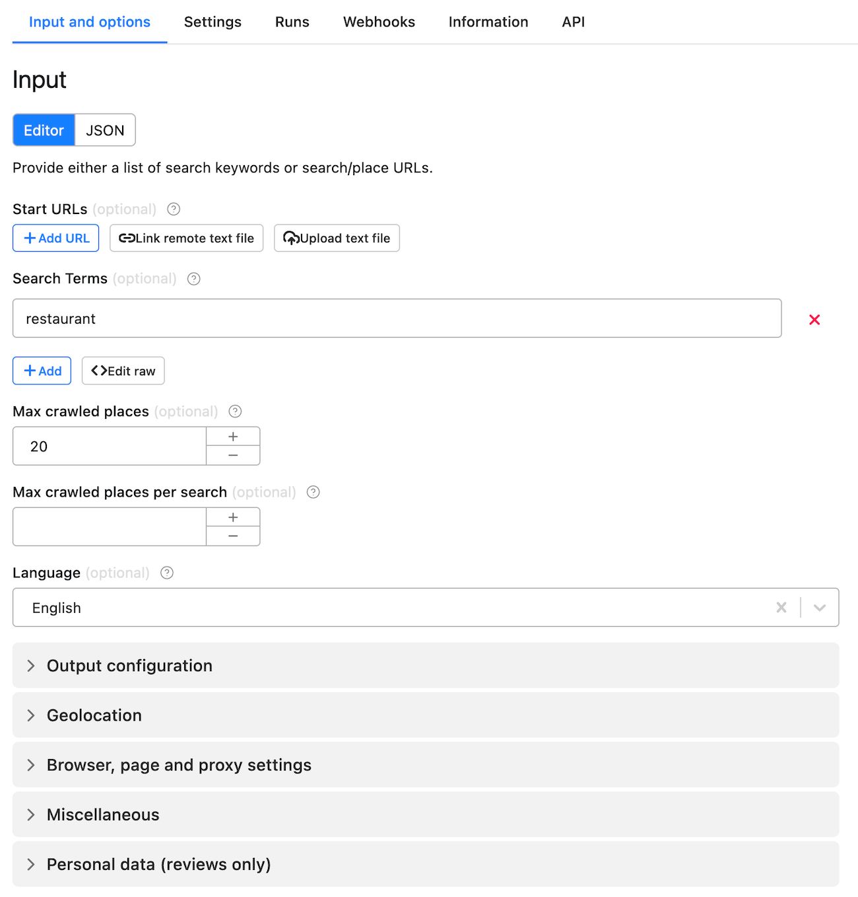

# Actor tasks

**Set up configurations of your Apify actors for simplified usage. Create multiple configurations of the same actor tailored to various use cases.**

---

Tasks let you create multiple re-usable configurations of a single actor that are adapted for specific use cases. For example, you can create one **Web Scraper** ([apify/web-scraper](https://apify.com/apify/web-scraper)) configuration (task) that scrapes the latest reviews from imdb.com, another that scrapes nike.com for the latest sneakers, and a third that scrapes your competitor's e-shop. You can then use and reuse these configurations directly from [Apify Console](https://console.apify.com/actors/tasks), [schedules](../schedules.md), or [API](/api/v2#/reference/actor-tasks/run-collection/run-task).

All your tasks are listed at [https://console.apify.com/actors/tasks](https://console.apify.com/actors/tasks).

You can create tasks both for your personal actors and for those made by someone else. Just [search Apify Store](https://console.apify.com/store) to find an actor you want to use and click the **Create new task** button.

Like any other resource, you can share your actor tasks with other Apify users via the [access rights](../access_rights/index.md) system.

## Create

Open any actor from [Apify Store](https://console.apify.com/store) or your list of [actors](https://console.apify.com/actors) in Apify Console. In the top-right section of the page, click the **Create empty task** button.

## Configure

You can set up your task's input under the **Input and options** tab. A task's input configuration works just like an actor's. After all, it is just a copy of an actor you can pre-configure for a specific scenario. You can use either JSON or the visual input UI.

Actors' input fields will vary depending on their purpose, but they all follow the same principle: you provide an actor with the information it needs so it can do what you want it to do.

You can set run options such as timeout and [memory](./running/memory_and_cpu.md) at the bottom of the input section.

### Identifying tasks

To make a task easier to identify, you can give it a name, title, and description by clicking it's caption on the detail page.  A task's name should be 3-63 characters long.

### Settings

Under the **Settings** tab of their detail page, you can grant [access rights](../access_rights/index.md) to other Apify users.

## Run

Once you've configured you task, you can run it using the **Run** button in the bottom-left side of the **Input and options** tab.

You can also run tasks using:

- [Schedules](../schedules.md).
- Directly via the [Apify API](/api/v2#/reference/actor-tasks/run-collection/run-task).
- The [JavaScript API client]({{@link apify_client_js.md#taskclient}}).
- The [Python API client]({{@link apify_client_python.md#taskclient}}).
