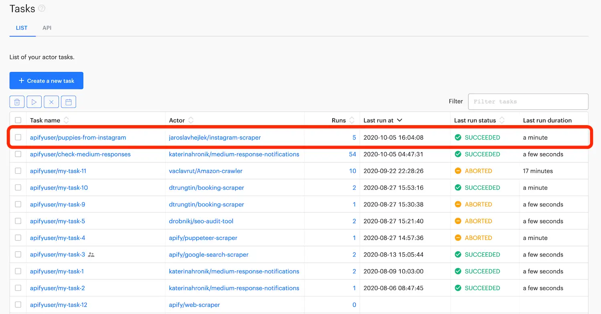

#  Monitor actor or task runs for failure

This example walks you through setting up [monitoring](https://apify.com/apify/monitoring) for an [actor](../../academy/getting_started/actors.md). The monitoring suite will send you notifications when the actor or task fails or returns too few results.

##  Use case

You want to be notified when an actor / task **does not** finish successfully.

This means the [notification]({{@link monitoring.md#notifications}}) will be sent whenever the actor or task:

- Fails (finishes with the status **FAILED**).
- Times out (finishes with status **TIMED OUT**).
- There are no results or there are fewer results than [expected](#validate-data).

For this example, we will use an **Instagram Scraper** ([jaroslavhejlek/instagram-scraper](https://apify.com/jaroslavhejlek/instagram-scraper)) task which gets a fresh batch of `#puppies` photos every day.

Let us say you have created a task named **puppies-from-instagram** and run it regularly (manually or using a [schedule](../schedules.md)).

##  Create a new monitoring task

If you haven't already, [add the monitoring suite to your account]({{@link monitoring.md#add-the-monitoring-suite-to-your-account}}).

If you have already added the task, under its **Settings** tab, give it a name. For example, **monitoring-puppies-are-ok**, since we're monitoring the **puppies-from-instagram** task.

> We recommend prefixing your monitoring task names with `monitoring-` so you could identify them easier.

Next, we will configure the monitoring suite.

##  Monitoring configuration

1. Under your task's **Input** tab, set the **Mode** dropdown to **Create configuration**.

2. Next, open the **What you want to monitor** section. Give the monitoring suite a name in the **Monitoring suite name** field, e.g. `puppies-are-ok`.

3. In the **Type of target:** dropdown, select **Task**, since you will be monitoring an Instagram Scraper task.

4. **Target name patterns** should be the name of your task, `puppies-from-instagram`.

5. Select the **Notify me whenever actor/task does not succeed** option to receive a report when a run finishes unsuccessfully.

> Each of your monitoring suites must have a unique name.

The configuration should look like this:

##  Validate data

Let's say you need a minimum number of 100 results.

1. Open the **Validating by a schema** section and select the **Enable schema validation** option.

2. In the **Validation options** field, create an [object](https://javascript.info/object) containing a `minItemCount` key with `100` as its value. You can also set this number to `1` if you want to be notified only when there are **no** items.

Finally, click the **Save & Run** button, and you're done.

From now on, you will get a [notification]({{@link monitoring.md#example-of-a-failed-run}}) to your account's email every time your `puppies-from-instagram` task doesn't succeed or returns fewer than 100 items.

