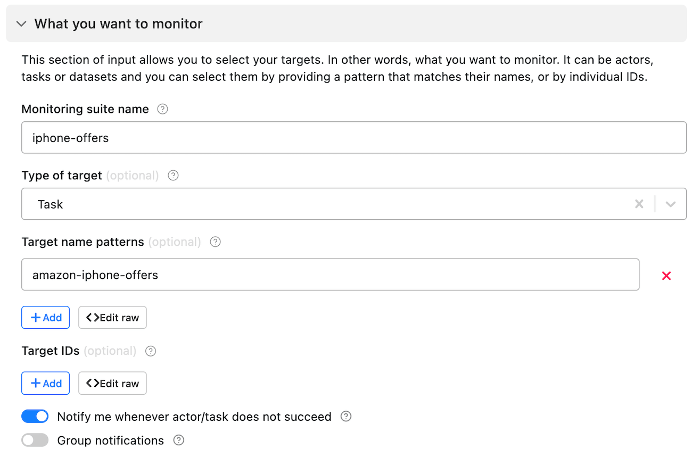
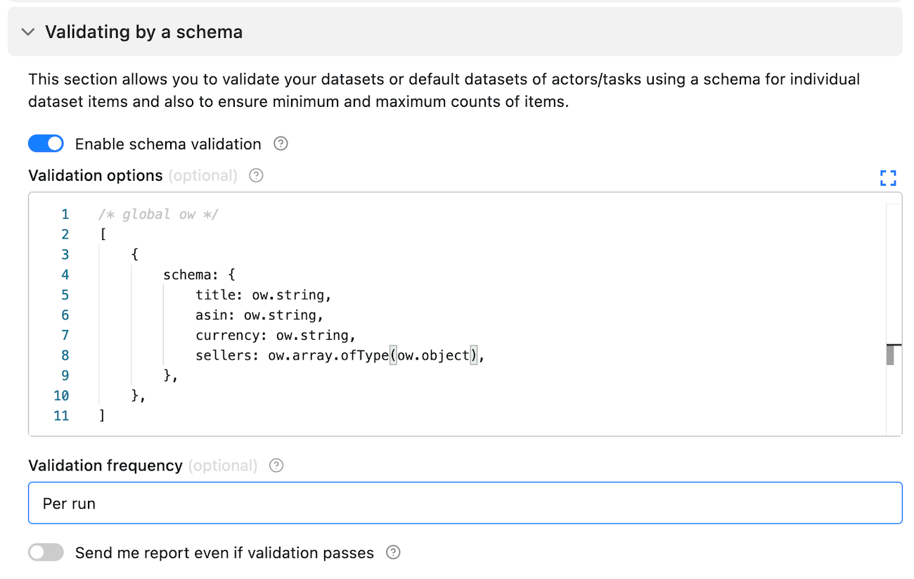
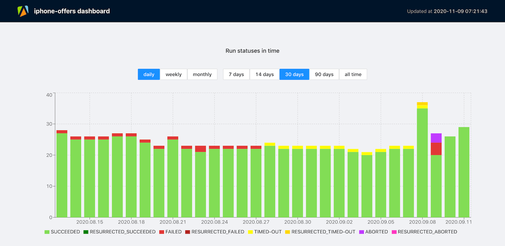

# Check product-based data for correct format and duplicates {#check-product-based-data-for-correct-format-and-duplicates}

**A step-by-step monitoring tutorial that shows you how to ensure your data is correctly formatted and unique. Visualize your data using the monitoring dashboard.**

---

This example walks you through setting up [monitoring](https://apify.com/apify/monitoring) for an [actor](../actors/index.md).

## Use case {#use-case}

You want regularly scrape product data using a single scraper.

You need:

- Data to always be in the [correct format](#validate-data).
- Alerts if items are [duplicated](#check-for-duplicates).
- [Notification](./index.md) when your scheduled run times out or fails.
- [Data visualization](#set-up-data-visualization) on a simple dashboard.

Let's say you're using the **Amazon Crawler** ([vaclavrut/amazon-crawler](https://apify.com/vaclavrut/amazon-crawler)) from [Apify Store](https://apify.com/store) to get daily **iPhone X** offers.

You have set up a task named `amazon-iphone-offers` and set up a [schedule](../schedules.md) named `iphone-daily-offers`. The schedule runs your task [every morning](https://crontab.guru/#0_7_*_*_*), so you have fresh data ready when you wake up.

## Create a new monitoring task {#create-a-new-monitoring-task}

If you haven't already, [add the monitoring suite to your account](./index.md).

If you have already added the task, under its **Settings** tab, give it a name. For example, `monitoring-iphone-offers`, since we're monitoring the `amazon-iphone-offers` task.

> We recommend prefixing your monitoring task names with `monitoring-` so you could identify them easier.

## Monitoring configuration {#monitoring-configuration}

1. Under your task's **Input** tab, set the **Mode** dropdown to **Create configuration**.

2. Next, open the **What you want to monitor** section. Give the monitoring suite a name in the **Monitoring suite name** field, e.g. `iphone-offers`.

3. In the **Type of target:** dropdown, select **Task**, since you will be monitoring an Amazon Crawler task.

4. **Target name patterns** should be the name of your task, `amazon-iphone-offers`.

5. Select the **Notify me whenever actor/task does not succeed** option to receive a report when a run finishes unsuccessfully.

> Each of your monitoring suites must have a unique name.

This is what the configuration should look like:

## Validate data {#validate-data}

Let's say you need each item to always have properties such as `title`, `ASIN`, `currency` and a list of `sellers`.

1. Open the **Validating by a schema** section and select the **Enable schema validation** option.

2. In the **Validation options** field, create an [object](https://javascript.info/object) containing a `schema` key. As its value, set an object specifying the format of each of the properties you want to validate.

The monitoring suite uses the [ow](https://www.npmjs.com/package/ow) library for type validation. Make sure to import the library using `/* global ow */`.

> Validation is done after each run finishes.

## Check for duplicates {#check-for-duplicates}

1. In the **Check for duplicates** section, select the **Enable duplicate items check** option.

2. Set the **Unique keys** field to `asin` to make sure all the ASIN properties are unique.

## Set up data visualization {#set-up-data-visualization}

In the **Statistics dashboard** section, check the **Enable dashboard** option to activate data visualization.

Finally, click the **Save & Run** button. It will create a monitoring configuration and turn the monitoring ON.

## Getting your results {#getting-your-results}

Following each of your `amazon-iphone-offers` tasks runs, the suite will process your results and report if any of the checks fail. You receive an email with a link to your **monitoring project dashboard**.

Here, you can see the result statuses of your monitored tasks and filter them by time. You can also see each run's [key-value store](../storage/key_value_store.md) item charts.

This is what your dashboard can look like after some time:

