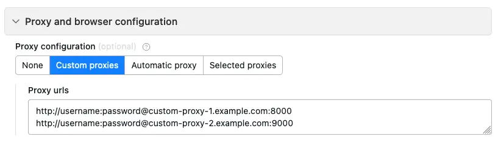

#  Proxy

[Apify Proxy](https://apify.com/proxy) allows you to change your IP address when web scraping to reduce the chance of being [blocked](../web_scraping_101/anti_scraping_techniques.md) because of your geographical location.

You can use proxies in your [actors](../actors/index.md) or any other application that supports HTTP, HTTPS, and FTP protocols. Apify Proxy monitors the health of your IP pool and intelligently [rotates addresses](#ip-address-rotation) to prevent IP address-based blocking.

**You can view your proxy settings and password on the [Proxy](https://console.apify.com/proxy) page in the Apify Console.**

##  Our proxies

[Datacenter proxy](./datacenter_proxy/index.md)]

[Residential proxy](./residential_proxy/index.md)]

[Google SERP proxy](./google_serp_proxy/index.md)]

**For pricing information, visit [apify.com/proxy](https://apify.com/proxy).**

## Using your own proxies

In addition to our proxies, you can use your own both in Apify Console and SDK.

###  Custom proxies in console

To use your own proxies with Apify Console, in your actor's **Input and options** tab, scroll down and open the **Proxy and browser configuration** section. Enter your proxy URLs, and you're good to go.

###  Custom proxies in SDK

In the Apify SDK, use the `proxyConfiguration.newUrl(sessionId)` command to add your custom proxy URLs to the proxy configuration. See the [SDK docs](https://sdk.apify.com/api/apify/class/ProxyConfiguration#newUrl) for more details.

##  IP address rotation

Web scrapers can rotate the IP addresses they use to access websites. They assign each request a different IP address, which makes it appear like they are all coming from different users. This greatly enhances performance and data throughout.

Depending on whether you use a [browser](https://apify.com/apify/web-scraper) or [HTTP requests](https://apify.com/apify/cheerio-scraper) for your scraping jobs, IP address rotation works differently.

* Browser – a different IP address is used for each browser.
* HTTP request – a different IP address is used for each request.

**You can use [sessions](#sessions) to manage how you rotate and [persist](#session-persistence) IP addresses.**

[Click here](../web_scraping_101/anti_scraping_techniques.md) to learn more about IP address rotation and our findings on how blocking works.

##  Sessions

Sessions allow you to use the same IP address for multiple connections.

To set a new session, pass the [`session`](./connection_settings.md), pass that same session ID in the username field.

The created session will store information such as cookies and can be used to generate [browser fingerprints](https://pixelprivacy.com/resources/browser-fingerprinting/). You can also assign custom user data such as authorization tokens and specific headers.

Sessions are available for [datacenter](./datacenter_proxy/index.md) proxies.

**This parameter is optional**. By default, each proxied request is assigned a randomly picked least used IP address.

###  Session persistence

You can persist your sessions (use the same IP address) by setting the `session` parameter in the `username` [field](./connection_settings.md). This assigns a single IP address to a **session ID** after you make the first request.

**Session IDs represent IP addresses. Therefore, you can manage the IP addresses you use by managing sessions.** In cases where you need to keep the same session (e.g. when you need to log in to a website), it is best to keep the same proxy. By assigning an IP address to a **session ID**, you can use that IP for every request you make.

For datacenter proxies, a session persists for **26 hours** ([more info](./datacenter_proxy/index.md)). Using a session resets its expiry timer.

Google SERP proxies do not support sessions.

##  Dead proxies

Our health check performs an HTTP and HTTPS request with each proxy server every few hours. If a server fails both requests 3 times in a row, it's marked as dead and all user sessions with this server are discarded.

Banned proxies are not considered dead, since they become usable after a while.
